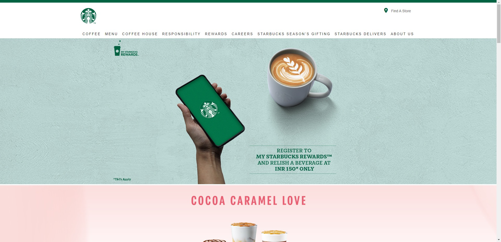

# Starbucks UI Clone

This is a clone of the Starbucks website, created using HTML and CSS.

## Technologies Used

* HTML
* CSS

## Usage

To run the project, open the index.html file in a web browser.

## Author

This project was created by Chirag P. Gauswami.

## Requirements

* A web browser
* A basic understanding of HTML and CSS 

## Instructions

1. Clone the repository to your local machine.
2. Open the index.html file in a web browser.
3. The clock will start updating every second.

## License

This project is just for learning purpose.

## Links

* [Source Code](https://github.com/chiragpgauswami/starbucks-clone)
* [Demo](https://chiragpgauswami.github.io/starbucks-clone)